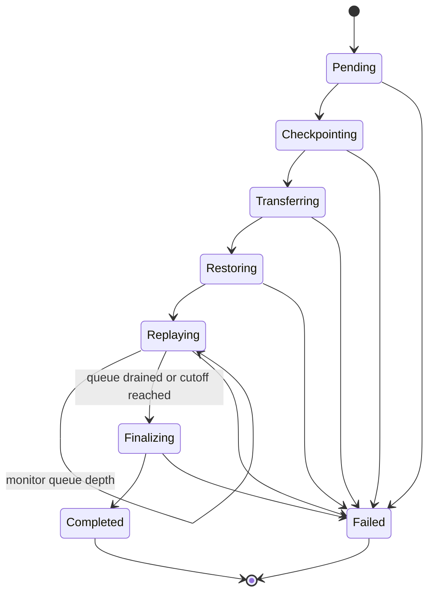
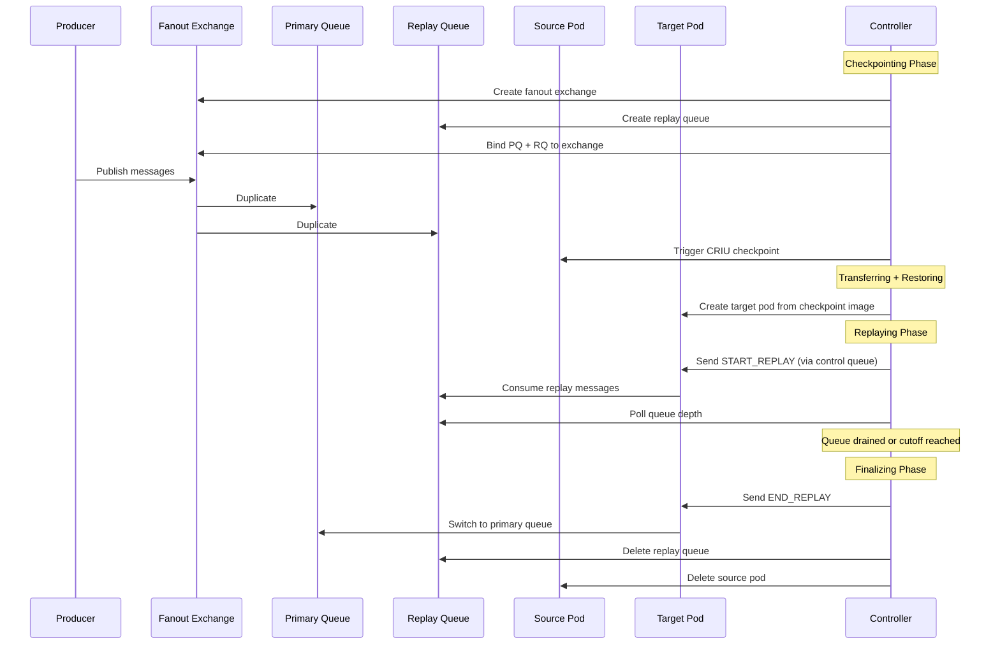

# MS2M Controller

**Message-based Stateful Microservice Migration for Kubernetes**

[](https://go.dev)
[](https://kubernetes.io)
[](LICENSE)

A Kubernetes operator that performs live migration of stateful microservices between cluster nodes. It combines CRIU-based container checkpointing with message queue replay to preserve both in-memory execution state and in-flight message consistency -- achieving zero-downtime, zero-message-loss pod migration.

This operator extends and advances the MS2M framework described in [Dinh-Tuan & Beierle (2022)](https://ieeexplore.ieee.org/abstract/document/9766576) and [Dinh-Tuan & Jiang (2025)](https://ieeexplore.ieee.org/abstract/document/10942720) with a production-grade declarative architecture and several new mechanisms not present in either publication.

## Background

Standard Kubernetes mechanisms (e.g., pod eviction, node drain, StatefulSet rescheduling) handle pod mobility through a destructive delete-and-recreate cycle. While this works for stateless workloads, it causes loss of in-memory state, dropped connections, and potential data inconsistency for stateful microservices that maintain runtime caches, session data, or message processing state.

MS2M addresses this gap with a **preservative migration** model: checkpoint a running container's full process state via CRIU, transfer the checkpoint to a target node, restore the container with its complete memory and execution context intact, and replay any messages published during the migration window through a secondary queue.

### Prior Work

The original MS2M concept ([CIoT 2022](https://ieeexplore.ieee.org/abstract/document/9766576)) demonstrated this approach on Podman with raw CRIU and direct host-to-host transfer (rsync/SSH), orchestrated by an imperative Python script. It achieved a 19.92% downtime reduction compared to stop-and-copy migration.

The Kubernetes integration ([ICIN 2025](https://ieeexplore.ieee.org/abstract/document/10942720)) adapted the framework to use Forensic Container Checkpointing (FCC) via the kubelet API, introduced a Sequential migration strategy for StatefulSet-managed pods, and added a threshold-based cutoff mechanism for bounded replay time. It was still orchestrated by an imperative Python Migration Manager and demonstrated up to 96.99% downtime reduction versus cold migration.

### What This Operator Adds

This repository advances both publications with the following new contributions:

| Advancement | Description |
|:------------|:------------|
| **Declarative Kubernetes operator** | Replaces the imperative Python Migration Manager with a controller-runtime reconciler. Migrations are expressed as `StatefulMigration` custom resources; a reconciliation loop drives the state machine through the Kubernetes control plane. |
| **ShadowPod strategy for StatefulSets** | Both papers only support Sequential (scale-to-zero) for StatefulSet pods. This operator adds a ShadowPod path where source and target coexist during replay, then the StatefulSet is scaled down by one replica in finalization -- avoiding the downtime gap where the source is killed before the target exists. |
| **Direct node-to-node transfer mode** | Both papers describe only registry-based checkpoint transfer. This operator adds a second path: a DaemonSet agent (`ms2m-agent`) on each node receives checkpoint tarballs via HTTP and loads them directly into the local CRI-O, bypassing the container registry entirely. |
| **Deployment-aware finalization** | Neither paper addresses Deployment-managed pods. The operator patches the owning Deployment's pod template with `nodeAffinity` targeting the destination node, so replacement pods are scheduled correctly after the source is deleted. |
| **Automatic strategy detection** | The operator inspects the source pod's `ownerReferences` to auto-select Sequential (StatefulSet) or ShadowPod (Deployment/standalone) when no strategy is specified. |
| **Phase chaining** | When a phase completes synchronously, the reconciler re-fetches the resource and immediately enters the next phase handler within the same API call, avoiding work queue round-trips. |
| **Exponential polling backoff** | Transferring, Restoring, and Replaying use adaptive requeue intervals (1s -> 2s -> 5s based on elapsed time) to reduce API server load. The papers use fixed polling intervals. |
| **Uncompressed OCI checkpoint layers** | The checkpoint image builder deliberately skips gzip compression. On cluster-local networks, CPU cost of compression outweighs bandwidth savings. |
| **Source pod metadata caching** | For Sequential strategy, the source pod is deleted before the target is created. The operator caches source pod labels and container specs in the CRD status during Pending so they remain available during Restoring. |
| **CRIU-aware hostname resolution** | After checkpoint/restore, `gethostname()` returns the UTS hostname from the checkpointed process (the source pod name). The consumer reads `/etc/hostname` instead (bind-mounted by the container runtime), which reflects the actual pod name for correct control queue routing. |

## Architecture

The system consists of five cooperating components:

```
                    Kubernetes API Server
                   /          |          \
                  /           |           \
      +-----------+   +---------------+   +------------+
      | Controller|   | Transfer Job  |   |  Registry  |
      | (manager) |   | (source node) |   |  (OCI)     |
      +-----------+   +---------------+   +------------+
           |                  |                  |
           |   +-----------+  |  +-----------+   |
           +-->| Source     |--+  | Target    |<--+
               | Kubelet   |     | Kubelet   |
               | (Node A)  |     | (Node B)  |
               +-----------+     +-----------+
                                      ^
                                      |
                                 +-----------+
                                 | ms2m-agent|  (Direct transfer mode)
                                 | DaemonSet |
                                 +-----------+
```

- **Controller** -- Runs as a Deployment. Watches `StatefulMigration` custom resources and drives the phase-based state machine through each migration stage via reconciliation.
- **Source Kubelet** -- Executes the CRIU checkpoint via the kubelet checkpoint API (`POST /checkpoint/{namespace}/{pod}/{container}`), proxied through the API server.
- **Transfer Job** -- An ephemeral Kubernetes Job scheduled on the source node. Packages the checkpoint tarball as a single-layer OCI image using [go-containerregistry](https://github.com/google/go-containerregistry). In Registry mode, pushes to a container registry. In Direct mode, POSTs to the ms2m-agent on the target node.
- **ms2m-agent** -- A DaemonSet running on each node (Direct transfer mode only). Receives checkpoint tarballs via HTTP, builds the OCI image locally, and loads it into CRI-O via `skopeo copy`, bypassing the registry.
- **Target Kubelet** -- Pulls (or loads) the checkpoint image and restores the container with its full in-memory state on the target node.

## Migration Phases

A `StatefulMigration` resource progresses through a well-defined state machine:



| Phase | Description |
|:------|:------------|
| **Pending** | Validates the migration spec. Resolves the source pod's node, container name, and owner references (StatefulSet, Deployment, or standalone). Caches source pod labels and container specs in the CRD status for later use. Auto-detects the migration strategy from `ownerReferences` if not specified. |
| **Checkpointing** | Connects to the message broker. Declares a fanout exchange and creates a secondary replay queue bound alongside the primary queue, so all new messages are duplicated. Triggers a CRIU checkpoint via the kubelet API. |
| **Transferring** | Launches a Transfer Job on the source node. In Registry mode, the job builds an uncompressed OCI image from the checkpoint tarball and pushes it to the configured registry. In Direct mode, it streams the tarball to the ms2m-agent on the target node. Polls job completion with exponential backoff. |
| **Restoring** | Creates a target pod on the destination node using the checkpoint image. For Sequential strategy, scales down the owning StatefulSet first and waits for the source pod to terminate. For ShadowPod, the source remains running. Waits for the target pod to reach Running state. |
| **Replaying** | Sends a `START_REPLAY` control message to the target pod via its RabbitMQ control queue. Monitors the replay queue depth with exponential backoff polling. Proceeds to finalization when the queue is drained to zero or the `replayCutoffSeconds` threshold is exceeded. |
| **Finalizing** | Sends `END_REPLAY` and tears down the secondary queue. Cleanup depends on strategy and workload type: Sequential scales the StatefulSet back to its original replica count. ShadowPod with a Deployment deletes the source pod and patches the Deployment with `nodeAffinity` for the target node. ShadowPod with a StatefulSet scales down by one replica. Closes the broker connection and marks the migration as Completed. |

## Migration Strategies

### ShadowPod

The controller creates a shadow pod (e.g., `worker-0-shadow`) on the target node while the source pod is still running. Both pods coexist during the replay phase, ensuring the target can catch up on messages before traffic is switched. This minimizes downtime since the source continues processing while the target replays missed messages.

During finalization, cleanup depends on the workload type:

- **Deployment-managed pods**: the source pod is deleted directly. The controller patches the owning Deployment's pod template with `nodeAffinity` targeting the destination node, ensuring replacement pods are scheduled on the correct node.
- **StatefulSet-managed pods** *(new in this operator)*: the StatefulSet is scaled down by one replica instead of deleting the pod directly, since direct deletion would cause the StatefulSet controller to recreate it. The shadow pod (carrying the app label) continues serving traffic via the Service.
- **Standalone pods**: the source pod is deleted directly.

### Sequential

Designed for StatefulSet pods with strict identity requirements where `worker-0` cannot exist as two pods simultaneously. The Sequential strategy scales the owning StatefulSet to zero replicas, waits for the StatefulSet controller to delete the source pod, then creates the target pod with the same identity using the checkpoint image. After migration completes, the StatefulSet is scaled back to its original replica count.

This strategy incurs higher downtime than ShadowPod since the source is stopped before the target is created.

### Auto-Detection

When `migrationStrategy` is omitted, the controller inspects the source pod's `ownerReferences`:
- If owned by a StatefulSet, defaults to **Sequential**.
- Otherwise, defaults to **ShadowPod**.

To use the ShadowPod strategy with a StatefulSet-managed pod, set `migrationStrategy: ShadowPod` explicitly in the CR spec.

## Checkpoint Transfer Modes

### Registry (default)

The Transfer Job packages the checkpoint tarball as a single-layer OCI image and pushes it to the configured container registry. The target node's kubelet pulls the image when creating the restored pod. This mode requires a container registry accessible from all nodes.

The OCI image is built without gzip compression: on cluster-local networks, the CPU cost of compression outweighs bandwidth savings, and the uncompressed layer can be pulled faster.

### Direct

The Transfer Job streams the checkpoint tarball directly to the `ms2m-agent` DaemonSet on the target node via HTTP POST. The agent builds the OCI image locally and loads it into CRI-O using `skopeo copy`, bypassing the registry entirely. This mode eliminates the registry as a dependency and avoids the push-pull round-trip.

To use Direct mode, deploy the ms2m-agent DaemonSet and set `transferMode: Direct` in the CR spec:

```bash
kubectl apply -f config/daemonset/ms2m-agent.yaml
```

## How It Works

### Message Queue Replay

The replay mechanism ensures zero message loss during migration:



1. **Fan-out setup** -- Before checkpointing, the controller declares a fanout exchange and binds both the primary and a secondary replay queue. All new messages are duplicated to both queues.
2. **Checkpoint** -- CRIU freezes the source container's process state. The container has processed all messages up to this point.
3. **Restore** -- The target pod starts from the checkpoint image, resuming with the exact process state at checkpoint time.
4. **Replay** -- The target pod consumes and processes messages from the replay queue (which contains every message published since the fan-out was established).
5. **Cutover** -- Once the replay queue is drained (or the cutoff threshold is reached), the target pod switches to the primary queue and the source pod is removed.

### Consumer-Side Contract

The target application must implement a control message listener on the queue `ms2m.control.<pod-name>` that handles two message types:

| Control Message | Action |
|:----------------|:-------|
| `START_REPLAY` | Switch consumption from the primary queue to the replay queue specified in `payload.queue` |
| `END_REPLAY` | Switch back to consuming from the primary queue |

After CRIU restore, the consumer must resolve its hostname from `/etc/hostname` (bind-mounted by the container runtime) rather than `gethostname()`, which returns the checkpointed UTS hostname of the source pod. This ensures the control queue name matches the actual pod name so the controller can route `START_REPLAY`/`END_REPLAY` correctly.

### Reconciler Optimizations

The reconciler implements two optimizations beyond standard controller-runtime patterns:

- **Phase chaining**: When a phase handler completes synchronously (returns an immediate requeue), the reconciler re-fetches the resource and enters the next handler within the same API call. This eliminates work queue round-trips for phases that complete instantly (e.g., Pending -> Checkpointing when validation passes on the first attempt).

- **Exponential polling backoff**: Long-running async phases (Transferring, Restoring, Replaying) use adaptive requeue intervals that increase from 1s to 2s to 5s based on elapsed wall-clock time. This reduces API server load during operations that typically take tens of seconds.

## Prerequisites

| Requirement | Details |
|:------------|:--------|
| **Kubernetes** | v1.30+ with the `ContainerCheckpoint` feature gate enabled |
| **Container Runtime** | CRI-O or containerd with CRIU checkpoint/restore support |
| **CRIU** | Installed on all cluster nodes (compiled with checkpoint support) |
| **Container Registry** | Accessible from all nodes (Registry transfer mode) |
| **Message Broker** | RabbitMQ or any AMQP 0-9-1 compatible broker |
| **Go** | v1.25+ (for building from source) |

### Enabling the ContainerCheckpoint Feature Gate

On kubeadm-managed clusters, add to the kubelet configuration:

```yaml
apiVersion: kubelet.config.k8s.io/v1beta1
kind: KubeletConfiguration
featureGates:
  ContainerCheckpoint: true
```

## Quick Start

### 1. Install the CRD

```bash
kubectl apply -f config/crd/bases/migration.ms2m.io_statefulmigrations.yaml
```

### 2. Deploy the controller

```bash
kubectl apply -f config/rbac/role.yaml
kubectl apply -f config/manager/manager.yaml
```

### 3. Create a migration

```bash
kubectl apply -f - <<EOF
apiVersion: migration.ms2m.io/v1alpha1
kind: StatefulMigration
metadata:
  name: migrate-worker-0
  namespace: default
spec:
  sourcePod: worker-0
  targetNode: node-b
  checkpointImageRepository: registry.example.com/checkpoints
  replayCutoffSeconds: 5
  messageQueueConfig:
    queueName: tasks
    brokerUrl: amqp://rabbitmq.default.svc:5672
    exchangeName: tasks.fanout
    routingKey: tasks
EOF
```

### 4. Monitor progress

```bash
# Watch phase transitions
kubectl get statefulmigration migrate-worker-0 -w

# Inspect detailed status and phase timings
kubectl describe statefulmigration migrate-worker-0
```

## Usage

### StatefulMigration Custom Resource

```yaml
apiVersion: migration.ms2m.io/v1alpha1
kind: StatefulMigration
metadata:
  name: migrate-worker-0
  namespace: default
spec:
  # Name of the pod to migrate (must be in the same namespace)
  sourcePod: worker-0

  # Container to checkpoint (defaults to the first container if omitted)
  containerName: worker

  # Target node for the restored pod (optional; uses scheduler if omitted)
  targetNode: node-b

  # Registry path for the checkpoint OCI image
  checkpointImageRepository: registry.example.com/checkpoints

  # Maximum seconds to wait for replay queue to drain before forced cutoff
  replayCutoffSeconds: 5

  # Message broker configuration
  messageQueueConfig:
    queueName: tasks
    brokerUrl: amqp://rabbitmq.default.svc:5672
    exchangeName: tasks.fanout
    routingKey: tasks

  # Migration strategy: "ShadowPod" or "Sequential" (auto-detected if omitted)
  migrationStrategy: ShadowPod

  # Transfer mode: "Registry" (default) or "Direct"
  transferMode: Registry
```

### Status Fields

The controller populates the following status fields during the migration:

| Field | Type | Description |
|:------|:-----|:------------|
| `phase` | string | Current phase (`Pending`, `Checkpointing`, `Transferring`, `Restoring`, `Replaying`, `Finalizing`, `Completed`, `Failed`) |
| `sourceNode` | string | Node where the source pod is running |
| `checkpointID` | string | Path to the CRIU checkpoint archive on the source node |
| `targetPod` | string | Name of the restored pod on the target node |
| `containerName` | string | Resolved container name (from spec or auto-detected as first container) |
| `startTime` | datetime | Timestamp when the migration was initiated |
| `phaseTimings` | map | Duration of each completed phase (e.g., `Checkpointing: 1.234s`) |
| `statefulSetName` | string | Owning StatefulSet name (if applicable) |
| `deploymentName` | string | Owning Deployment name (if applicable) |
| `originalReplicas` | int32 | StatefulSet replica count before scale-down (for restore in Sequential) |
| `conditions` | []Condition | Standard Kubernetes conditions for detailed status reporting |

## Development

### Building

```bash
# Build the controller binary
make build

# Run tests with coverage
make test

# Build the controller Docker image
make docker-build IMG=registry.example.com/ms2m-controller:latest

# Push the controller image
make docker-push IMG=registry.example.com/ms2m-controller:latest

# Build the checkpoint transfer image
docker build -t checkpoint-transfer:latest -f Dockerfile.transfer .
```

### Running Locally

The controller can run outside the cluster for development, using your local kubeconfig:

```bash
# Ensure your kubeconfig points to the target cluster
kubectl cluster-info

# Install the CRD
kubectl apply -f config/crd/bases/migration.ms2m.io_statefulmigrations.yaml

# Run the controller
make run
```

### Running Tests

```bash
# All tests with coverage
make test

# Specific packages
go test ./internal/controller/... -v
go test ./internal/messaging/... -v
go test ./internal/kubelet/... -v
go test ./cmd/checkpoint-transfer/... -v
```

### Deploying to a Cluster

```bash
# 1. Build and push images
export REGISTRY=registry.example.com
make docker-build IMG=$REGISTRY/ms2m-controller:latest
make docker-push  IMG=$REGISTRY/ms2m-controller:latest
docker build -t $REGISTRY/checkpoint-transfer:latest -f Dockerfile.transfer .
docker push $REGISTRY/checkpoint-transfer:latest

# 2. Update config/manager/manager.yaml with your image reference

# 3. Apply all resources
kubectl apply -f config/crd/bases/migration.ms2m.io_statefulmigrations.yaml
kubectl apply -f config/rbac/role.yaml
kubectl apply -f config/manager/manager.yaml

# 4. (Optional) Deploy ms2m-agent for Direct transfer mode
kubectl apply -f config/daemonset/ms2m-agent.yaml

# 5. Verify
kubectl get pods -l control-plane=controller-manager
kubectl logs -l control-plane=controller-manager -f
```

## Project Structure

```
cmd/
  main.go                              Controller entry point (controller-runtime manager)
  checkpoint-transfer/main.go          OCI image builder for checkpoint transfer (Registry + Direct)
  ms2m-agent/main.go                   Node-local DaemonSet agent for direct checkpoint transfer
api/v1alpha1/
  types.go                             StatefulMigration CRD type definitions
  groupversion_info.go                 API group registration
  deepcopy.go                          Deep copy functions for CRD types
internal/
  controller/
    statefulmigration_controller.go    Reconciler with phase-based state machine
    statefulmigration_controller_test.go  Comprehensive unit tests for all phases
  checkpoint/
    image.go                           Uncompressed OCI image builder for checkpoint tarballs
  kubelet/
    client.go                          Kubelet checkpoint API client (via API server proxy)
  messaging/
    client.go                          BrokerClient interface definition
    rabbitmq.go                        RabbitMQ implementation (fan-out, control messages, queue inspect)
    mock.go                            In-memory mock broker for unit tests
config/
  crd/bases/                           CRD YAML with OpenAPI v3 schema
  rbac/                                ClusterRole (pods, jobs, statefulsets, deployments, nodes/proxy)
  manager/                             Controller Deployment manifest
  daemonset/                           ms2m-agent DaemonSet + Service for direct transfer mode
eval/
  workloads/                           Consumer workload manifests (StatefulSet + Deployment variants)
  scripts/                             Automated evaluation scripts with downtime measurement
```

## Evaluation

The evaluation infrastructure targets bare-metal cloud VMs provisioned with `kubeadm`, running CRI-O as the container runtime with CRIU compiled from source. The test workload is a stateful message-processing microservice backed by RabbitMQ.

### Configurations

The evaluation covers three migration configurations that compare the strategies introduced in the prior papers with the new ShadowPod+StatefulSet strategy added in this operator:

| Configuration | Workload | Strategy | Source |
|:--------------|:---------|:---------|:-------|
| `statefulset-sequential` | StatefulSet | Sequential | Described in [ICIN 2025] |
| `statefulset-shadowpod` | StatefulSet | ShadowPod | **New in this operator** |
| `deployment-registry` | Deployment | ShadowPod | **New in this operator** |

### Running Evaluations

```bash
# Full evaluation across all configurations and message rates
bash eval/scripts/run_full_evaluation.sh

# Single-configuration evaluation
CONFIGURATION=deployment-registry bash eval/scripts/run_optimized_evaluation.sh

# Combined downtime + migration time measurement (with HTTP probing at 10ms intervals)
bash eval/scripts/run_downtime_measurement.sh

# Quick test with 1 repetition
REPETITIONS=1 bash eval/scripts/run_downtime_measurement.sh
```

### Metrics

- **Checkpoint duration** -- Time to freeze and serialize container state via CRIU
- **Transfer duration** -- Time to build the OCI image and push to registry (or POST to agent)
- **Restore duration** -- Time to pull/load the image and resume the container
- **Replay duration** -- Time to drain the secondary queue and reach message consistency
- **Total migration time** -- Wall-clock time from CR creation to Completed phase
- **Service downtime** -- Longest contiguous period of HTTP probe failures during migration (measured by a probe pod polling at 10ms intervals)
- **Message loss** -- Number of messages dropped during migration (target: zero)

## Related Publications

This operator is the engineering realization of a multi-year research effort on live migration of stateful microservices:

1. **H. Dinh-Tuan and F. Beierle**, "MS2M: A Message-Based Approach for Live Stateful Microservices Migration," *2022 5th Conference on Cloud and Internet of Things (CIoT)*, 2022. [[IEEE]](https://ieeexplore.ieee.org/abstract/document/9766576)

   Introduced the core MS2M concept: leveraging an application's existing messaging infrastructure to reconstruct state on the target host via message replay, rather than relying on low-level memory transfer. The proof-of-concept was built on Podman and raw CRIU with direct host-to-host transfer (rsync/SSH), orchestrated by an imperative Python script. Demonstrated a **19.92% reduction in service downtime** compared to traditional stop-and-copy migration.

2. **H. Dinh-Tuan and J. Jiang**, "Optimizing Stateful Microservice Migration in Kubernetes with MS2M and Forensic Checkpointing," *2025 28th Conference on Innovation in Clouds, Internet and Networks (ICIN)*, 2025. [[IEEE]](https://ieeexplore.ieee.org/abstract/document/10942720)

   Bridged the gap between the MS2M concept and Kubernetes. Integrated Forensic Container Checkpointing (FCC) via the kubelet API, introduced a Sequential migration strategy for StatefulSet-managed pods, and added a Threshold-Based Cutoff Mechanism to bound the replay phase under high message rates. Still orchestrated by an imperative Python Migration Manager. Demonstrated up to **96.99% downtime reduction** compared to cold migration and 81.81% total migration time reduction at high load.

### Conceptual Contributions

This operator introduces three new ideas not present in either publication:

1. **ShadowPod migration for identity-bound (StatefulSet) workloads.** Both papers treat StatefulSet pods as requiring Sequential migration -- the source must be killed before the target is created because Kubernetes enforces unique pod identities. This operator shows that constraint can be sidestepped: a shadow pod with a different name (e.g., `consumer-0-shadow`) carries the same app labels and serves traffic via the Service, then the StatefulSet is scaled down to remove the original. The identity conflict is avoided because the shadow pod is not owned by the StatefulSet. This is a new migration strategy variant that reduces downtime for StatefulSet workloads compared to anything described in either paper.

2. **Registry-free direct checkpoint transfer.** Both papers assume an OCI registry as the transfer intermediary (push from source node, pull on target node). This operator introduces a direct transfer path: the checkpoint tarball is streamed node-to-node via HTTP to a DaemonSet agent that loads it into the local container runtime. This eliminates the registry as an infrastructure dependency and removes the push-pull round-trip -- a different transfer topology (point-to-point vs. hub-and-spoke).

3. **Deployment-aware migration with affinity steering.** Neither paper addresses Deployment-managed pods -- they only consider standalone pods and StatefulSets. This operator handles the Deployment case by patching the owning Deployment's pod template with `nodeAffinity` after migration, ensuring the Deployment controller schedules future pods on the target node. This extends the scope of MS2M from StatefulSet/standalone workloads to the most common Kubernetes workload type.

### Engineering Advancements

Beyond the conceptual contributions, this operator replaces the imperative Python Migration Manager from both papers with a declarative Kubernetes operator built on controller-runtime, and introduces several engineering refinements:

- **Automatic strategy detection** -- Inspects `ownerReferences` to select the appropriate strategy without manual configuration.
- **Phase chaining** -- Synchronously completed phases are chained within a single reconcile call, eliminating work queue round-trips.
- **Exponential polling backoff** -- Adaptive requeue intervals (1s -> 2s -> 5s) for long-running async phases, reducing API server load.
- **Uncompressed OCI image layers** -- Eliminates unnecessary gzip compression for cluster-local checkpoint transfer where CPU cost outweighs bandwidth savings.
- **Source pod metadata caching** -- Caches labels and container specs in the CRD status during Pending so they survive source pod deletion in Sequential strategy.
- **CRIU-aware hostname resolution** -- After checkpoint/restore, `gethostname()` returns the checkpointed UTS hostname. The consumer reads `/etc/hostname` (bind-mounted by the container runtime) to get the actual pod name for correct control queue routing.

## License

This project is licensed under the MIT License. See [LICENSE](LICENSE) for details.
