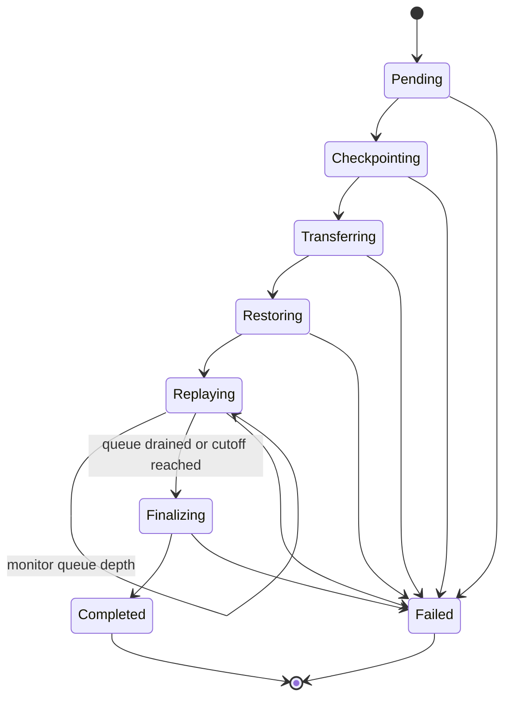
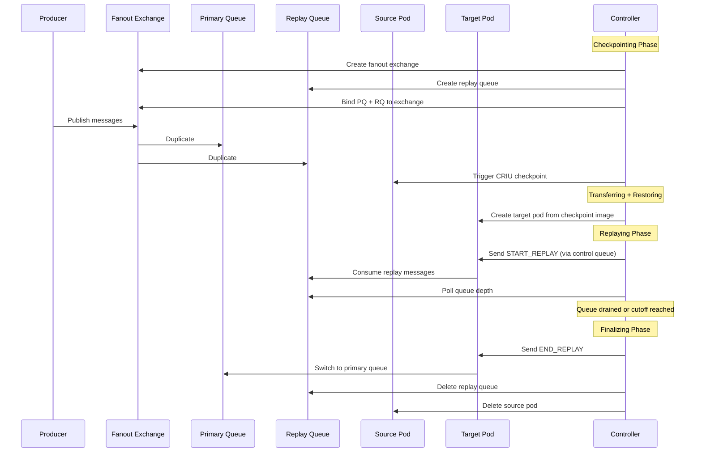

# MS2M Controller

**Message-based Stateful Microservice Migration for Kubernetes**

[](https://go.dev)
[](https://kubernetes.io)
[](LICENSE)

A Kubernetes controller that performs live migration of stateful microservices between cluster nodes. It combines CRIU-based container checkpointing with message queue replay to preserve both in-memory execution state and in-flight message consistency -- achieving zero-downtime, zero-message-loss pod migration.

## Overview

Standard Kubernetes mechanisms (e.g., pod eviction, node drain, StatefulSet rescheduling) handle pod mobility through a destructive delete-and-recreate cycle. While this works for stateless workloads, it causes loss of in-memory state, dropped connections, and potential data inconsistency for stateful microservices that maintain runtime caches, session data, or message processing state.

MS2M addresses this gap by introducing a **preservative migration** model. The controller checkpoints a running container's full process state via CRIU (Checkpoint/Restore In Userspace), transfers the checkpoint as an OCI image to a target node, and restores the container with its complete memory, file descriptors, and execution context intact. Concurrently, a fan-out message queue ensures that messages published during the migration window are duplicated to a secondary replay queue, which the restored container drains before assuming primary duties.

This project implements the MS2M framework as described in a master's thesis on live migration of stateful microservices in Kubernetes environments. The controller is built on the [controller-runtime](https://github.com/kubernetes-sigs/controller-runtime) framework and defines a single Custom Resource Definition (`StatefulMigration`) that drives a phase-based state machine through the entire migration lifecycle.

## Architecture

The system consists of four cooperating actors:

```
                    Kubernetes API Server
                   /          |          \
                  /           |           \
      +-----------+   +---------------+   +------------+
      | Controller|   | Transfer Job  |   |  Registry  |
      | (manager) |   | (source node) |   |  (OCI)     |
      +-----------+   +---------------+   +------------+
           |                  |                  |
           |   +-----------+  |  +-----------+   |
           +-->| Source     |--+  | Target    |<--+
               | Kubelet   |     | Kubelet   |
               | (Node A)  |     | (Node B)  |
               +-----------+     +-----------+
```

- **Controller** -- Runs as a Deployment in the cluster. Watches `StatefulMigration` custom resources and orchestrates the state machine through each migration phase.
- **Source Kubelet** -- Executes the CRIU checkpoint via the kubelet checkpoint API (`POST /checkpoint/{namespace}/{pod}/{container}`), proxied through the API server.
- **Transfer Job** -- An ephemeral Kubernetes Job scheduled on the source node. It packages the checkpoint tarball as a single-layer OCI image using [go-containerregistry](https://github.com/google/go-containerregistry) and pushes it to the container registry.
- **Target Kubelet** -- Pulls the checkpoint image from the registry and restores the container with its full in-memory state on the target node.

## Migration Phases

A `StatefulMigration` resource progresses through a well-defined state machine:



| Phase | Description |
|:------|:------------|
| **Pending** | Validates the migration spec, resolves the source pod's node, container name, and owner references. Auto-detects the migration strategy if not specified. |
| **Checkpointing** | Creates a secondary replay queue with fan-out binding on the message broker, then triggers a CRIU checkpoint via the kubelet API. |
| **Transferring** | Launches a Transfer Job on the source node to package the checkpoint tarball as an OCI image and push it to the configured container registry. |
| **Restoring** | Creates a target pod on the destination node using the checkpoint image. For Sequential migrations, scales down the owning StatefulSet first. |
| **Replaying** | Sends a `START_REPLAY` control message to the target pod. Monitors the replay queue depth and proceeds to finalization when the queue is drained or the cutoff threshold is exceeded. |
| **Finalizing** | Sends `END_REPLAY`, tears down the secondary queue, deletes the source pod (ShadowPod strategy) or scales the StatefulSet back up (Sequential strategy), and marks the migration as complete. |

## Key Features

- **Full process state preservation** -- CRIU captures memory, registers, file descriptors, and environment variables; the restored container resumes exactly where it left off.
- **Zero message loss** -- Fan-out duplication to a secondary queue ensures every message published during migration is replayed by the target pod.
- **Two migration strategies** -- ShadowPod (source and target coexist during replay) and Sequential (required for StatefulSet-managed pods with strict identity constraints).
- **Automatic strategy detection** -- Inspects the source pod's `ownerReferences` to select the appropriate strategy when not explicitly configured.
- **Phase timing instrumentation** -- Records the duration of each phase in `status.phaseTimings` for performance analysis and evaluation.
- **Exponential polling backoff** -- Adaptive requeue intervals for long-running phases (Transferring, Restoring, Replaying) to reduce API server load.
- **Phase chaining** -- Synchronously completed phases are chained within a single reconcile call to minimize work queue round-trips.

## Prerequisites

| Requirement | Details |
|:------------|:--------|
| **Kubernetes** | v1.30+ with the `ContainerCheckpoint` feature gate enabled |
| **Container Runtime** | CRI-O or containerd with CRIU checkpoint/restore support |
| **CRIU** | Installed on all cluster nodes (compiled with checkpoint support) |
| **Container Registry** | Accessible from all nodes for checkpoint image transfer |
| **Message Broker** | RabbitMQ or any AMQP 0-9-1 compatible broker |
| **Go** | v1.25+ (for building from source) |

### Enabling the ContainerCheckpoint Feature Gate

On kubeadm-managed clusters, add to the kubelet configuration:

```yaml
apiVersion: kubelet.config.k8s.io/v1beta1
kind: KubeletConfiguration
featureGates:
  ContainerCheckpoint: true
```

## Quick Start

### 1. Install the CRD

```bash
kubectl apply -f config/crd/bases/migration.ms2m.io_statefulmigrations.yaml
```

### 2. Deploy the controller

```bash
kubectl apply -f config/rbac/role.yaml
kubectl apply -f config/manager/manager.yaml
```

### 3. Create a migration

```bash
kubectl apply -f - <<EOF
apiVersion: migration.ms2m.io/v1alpha1
kind: StatefulMigration
metadata:
  name: migrate-worker-0
  namespace: default
spec:
  sourcePod: worker-0
  targetNode: node-b
  checkpointImageRepository: registry.example.com/checkpoints
  replayCutoffSeconds: 5
  messageQueueConfig:
    queueName: tasks
    brokerUrl: amqp://rabbitmq.default.svc:5672
    exchangeName: tasks.fanout
    routingKey: tasks
EOF
```

### 4. Monitor progress

```bash
# Watch phase transitions
kubectl get statefulmigration migrate-worker-0 -w

# Inspect detailed status and phase timings
kubectl describe statefulmigration migrate-worker-0
```

## Usage

### StatefulMigration Custom Resource

```yaml
apiVersion: migration.ms2m.io/v1alpha1
kind: StatefulMigration
metadata:
  name: migrate-worker-0
  namespace: default
spec:
  # Name of the pod to migrate (must be in the same namespace)
  sourcePod: worker-0

  # Container to checkpoint (defaults to the first container if omitted)
  containerName: worker

  # Target node for the restored pod (optional; uses scheduler if omitted)
  targetNode: node-b

  # Registry path for the checkpoint OCI image
  checkpointImageRepository: registry.example.com/checkpoints

  # Maximum seconds to wait for replay queue to drain before forced cutoff
  replayCutoffSeconds: 5

  # Message broker configuration
  messageQueueConfig:
    queueName: tasks
    brokerUrl: amqp://rabbitmq.default.svc:5672
    exchangeName: tasks.fanout
    routingKey: tasks

  # Migration strategy: "ShadowPod" or "Sequential" (auto-detected if omitted)
  migrationStrategy: ShadowPod
```

### Status Fields

The controller populates the following status fields during the migration:

| Field | Type | Description |
|:------|:-----|:------------|
| `phase` | string | Current phase (`Pending`, `Checkpointing`, `Transferring`, `Restoring`, `Replaying`, `Finalizing`, `Completed`, `Failed`) |
| `sourceNode` | string | Node where the source pod is running |
| `checkpointID` | string | Path to the CRIU checkpoint archive on the source node |
| `targetPod` | string | Name of the restored pod on the target node |
| `startTime` | datetime | Timestamp when the migration was initiated |
| `phaseTimings` | map | Duration of each completed phase (e.g., `Checkpointing: 1.234s`) |
| `conditions` | []Condition | Standard Kubernetes conditions for detailed status reporting |

## Migration Strategies

### ShadowPod (default for standalone pods)

The controller creates a shadow pod (e.g., `worker-0-shadow`) on the target node while the source pod is still running. Both pods coexist during the replay phase, ensuring the target can catch up on messages before traffic is switched. After finalization, the source pod is deleted.

This strategy minimizes downtime since the source continues processing while the target replays missed messages.

### Sequential (required for StatefulSet-managed pods)

StatefulSet pods have strict identity requirements -- `worker-0` cannot exist as two pods simultaneously. The Sequential strategy scales the owning StatefulSet to zero replicas, waits for the StatefulSet controller to delete the source pod, then creates the target pod with the same identity. After migration completes, the StatefulSet is scaled back to its original replica count.

### Auto-Detection

When `migrationStrategy` is omitted, the controller inspects the source pod's `ownerReferences`:
- If owned by a StatefulSet, defaults to **Sequential**.
- Otherwise, defaults to **ShadowPod**.

## How It Works

### Message Queue Replay

The replay mechanism ensures zero message loss during migration:



1. **Fan-out setup** -- Before checkpointing, the controller declares a fanout exchange and binds both the primary and a secondary replay queue. All new messages are duplicated to both queues.
2. **Checkpoint** -- CRIU freezes the source container's process state. The container has processed all messages up to this point.
3. **Restore** -- The target pod starts from the checkpoint image, resuming with the exact process state at checkpoint time.
4. **Replay** -- The target pod consumes and processes messages from the replay queue (which contains every message published since the fan-out was established).
5. **Cutover** -- Once the replay queue is drained, the target pod switches to the primary queue and the source pod is removed.

### Consumer-Side Contract

The target application must implement a control message listener on the queue `ms2m.control.<pod-name>` that handles two message types:

| Control Message | Action |
|:----------------|:-------|
| `START_REPLAY` | Switch consumption from the primary queue to the replay queue specified in `payload.queue` |
| `END_REPLAY` | Switch back to consuming from the primary queue |

## Development

### Building

```bash
# Build the controller binary
make build

# Run tests with coverage
make test

# Build the controller Docker image
make docker-build IMG=registry.example.com/ms2m-controller:latest

# Push the controller image
make docker-push IMG=registry.example.com/ms2m-controller:latest

# Build the checkpoint transfer image
docker build -t checkpoint-transfer:latest -f Dockerfile.transfer .
```

### Running Locally

The controller can run outside the cluster for development, using your local kubeconfig:

```bash
# Ensure your kubeconfig points to the target cluster
kubectl cluster-info

# Install the CRD
kubectl apply -f config/crd/bases/migration.ms2m.io_statefulmigrations.yaml

# Run the controller
make run
```

### Running Tests

```bash
# All tests with coverage
make test

# Specific packages
go test ./internal/controller/... -v
go test ./internal/messaging/... -v
go test ./internal/kubelet/... -v
go test ./cmd/checkpoint-transfer/... -v
```

### Deploying to a Cluster

```bash
# 1. Build and push images
export REGISTRY=registry.example.com
make docker-build IMG=$REGISTRY/ms2m-controller:latest
make docker-push  IMG=$REGISTRY/ms2m-controller:latest
docker build -t $REGISTRY/checkpoint-transfer:latest -f Dockerfile.transfer .
docker push $REGISTRY/checkpoint-transfer:latest

# 2. Update config/manager/manager.yaml with your image reference

# 3. Apply all resources
kubectl apply -f config/crd/bases/migration.ms2m.io_statefulmigrations.yaml
kubectl apply -f config/rbac/role.yaml
kubectl apply -f config/manager/manager.yaml

# 4. Verify
kubectl get pods -l control-plane=controller-manager
kubectl logs -l control-plane=controller-manager -f
```

## Project Structure

```
cmd/
  main.go                              Controller entry point
  checkpoint-transfer/main.go          OCI image builder for checkpoint transfer
api/v1alpha1/
  types.go                             StatefulMigration CRD type definitions
  groupversion_info.go                 API group registration
  deepcopy.go                          Generated deep copy functions
internal/
  controller/
    statefulmigration_controller.go    Reconciler with phase-based state machine
  kubelet/
    client.go                          Kubelet checkpoint API client (via API server proxy)
  messaging/
    client.go                          BrokerClient interface definition
    rabbitmq.go                        RabbitMQ (AMQP 0-9-1) implementation
    mock.go                            In-memory mock broker for unit tests
config/
  crd/bases/                           CRD YAML with OpenAPI v3 schema
  rbac/                                ClusterRole for the controller
  manager/                             Controller Deployment manifest
docs/                                  Design documents and lessons learned
terraform/                             GKE cluster provisioning (Terraform)
```

## Evaluation

The evaluation infrastructure targets bare-metal cloud VMs provisioned with `kubeadm`, running CRI-O as the container runtime with CRIU compiled from source. The test workload is a stateful message-processing microservice backed by RabbitMQ. Evaluation metrics include:

- **Checkpoint duration** -- Time to freeze and serialize container state
- **Transfer duration** -- Time to package and push the OCI checkpoint image
- **Restore duration** -- Time to pull the image and resume the container
- **Replay duration** -- Time to drain the secondary queue and reach consistency
- **Total downtime** -- End-to-end unavailability as perceived by clients
- **Message loss** -- Number of messages dropped during migration (target: zero)

## License

This project is licensed under the MIT License. See [LICENSE](LICENSE) for details.
