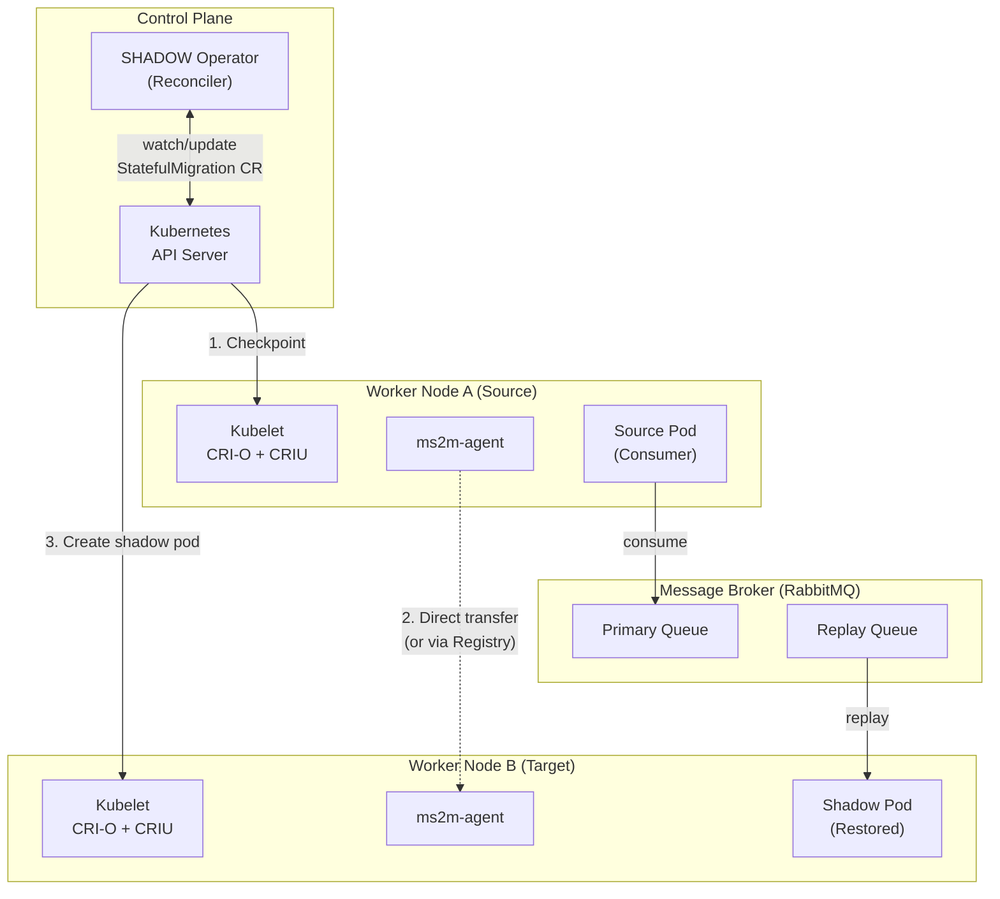
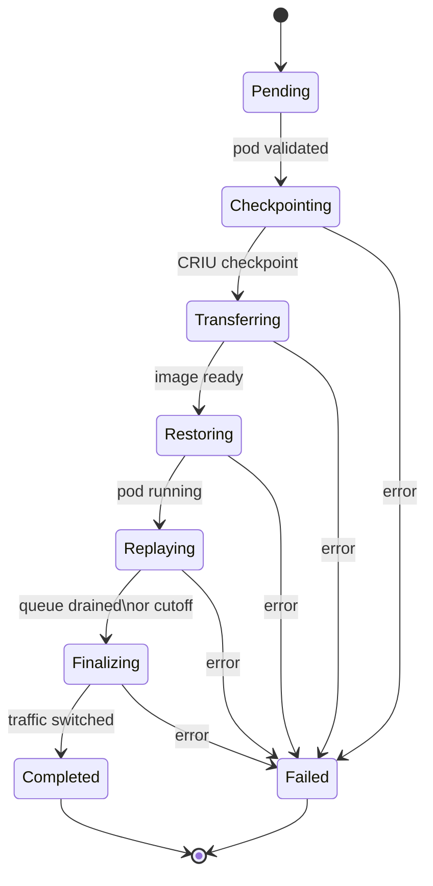

# SHADOW

**Seamless Handoff And Zero-Downtime Orchestrated Workload Migration for Stateful Microservices**

[](https://go.dev)
[](https://kubernetes.io)
[](LICENSE)

SHADOW is a Kubernetes operator that performs live migration of stateful microservices between cluster nodes with zero downtime and zero message loss. It combines CRIU-based container checkpointing with message queue replay to preserve both in-memory execution state and in-flight message consistency.

SHADOW builds on the MS2M (Message-based Stateful Microservice Migration) framework [[CIoT 2022]](https://ieeexplore.ieee.org/abstract/document/9766576), [[ICIN 2025]](https://ieeexplore.ieee.org/abstract/document/10942720) and introduces three key contributions:

- **ShadowPod migration strategy** -- Creates a shadow pod on the target node while the source continues serving traffic. Enables zero-downtime migration for both StatefulSet and Deployment workloads.
- **Exchange-Fence Convergence** -- An identity swap algorithm for StatefulSet workloads that uses message broker exchange-queue topology changes as an infrastructure-level consistent-cut primitive, achieving zero state gap without application-level markers.
- **Direct node-to-node checkpoint transfer** -- A DaemonSet agent (`ms2m-agent`) receives checkpoint archives via HTTP and loads them into the local container runtime, bypassing the OCI registry entirely.
- **Kubernetes-native operator** -- Replaces the external Python migration manager with a declarative `StatefulMigration` custom resource and a controller-runtime reconciler.

## Architecture


```mermaid
flowchart TB
    subgraph CP["Control Plane"]
        OP["SHADOW Operator\n(Reconciler)"]
        API["Kubernetes\nAPI Server"]
    end

    subgraph W1["Worker Node A (Source)"]
        K1["Kubelet\nCRI-O + CRIU"]
        A1["ms2m-agent"]
        SRC["Source Pod\n(Consumer)"]
    end

    subgraph W2["Worker Node B (Target)"]
        K2["Kubelet\nCRI-O + CRIU"]
        A2["ms2m-agent"]
        TGT["Shadow Pod\n(Restored)"]
    end

    subgraph MQ["Message Broker (RabbitMQ)"]
        PQ["Primary Queue"]
        RQ["Replay Queue"]
    end

    OP <-->|"watch/update\nStatefulMigration CR"| API
    API -->|"1. Checkpoint"| K1
    API -->|"3. Create shadow pod"| K2
    A1 -.->|"2. Direct transfer\n(or via Registry)"| A2
    SRC -->|"consume"| PQ
    RQ -->|"replay"| TGT
```

- **SHADOW Operator** -- Watches `StatefulMigration` custom resources and drives the phase-based state machine through each migration stage.
- **Source Kubelet** -- Executes the CRIU checkpoint via the kubelet checkpoint API, proxied through the API server.
- **Transfer Job** -- Ephemeral Job scheduled on the source node. Packages the checkpoint tarball as a single-layer OCI image. In Registry mode, pushes to a container registry. In Direct mode, POSTs to the ms2m-agent on the target node.
- **ms2m-agent** -- DaemonSet on each node (Direct transfer mode). Receives checkpoint tarballs via HTTP, builds the OCI image locally, and loads it into CRI-O via `skopeo copy`.
- **Target Kubelet** -- Pulls (or loads) the checkpoint image and restores the container on the target node.

## Migration Phases

A `StatefulMigration` resource progresses through an idempotent state machine:


```mermaid
stateDiagram-v2
    [*] --> Pending
    Pending --> Checkpointing : pod validated
    Checkpointing --> Transferring : CRIU checkpoint
    Transferring --> Restoring : image ready
    Restoring --> Replaying : pod running
    Replaying --> Finalizing : queue drained\nor cutoff
    Finalizing --> Completed : traffic switched

    Checkpointing --> Failed : error
    Transferring --> Failed : error
    Restoring --> Failed : error
    Replaying --> Failed : error
    Finalizing --> Failed : error

    Completed --> [*]
    Failed --> [*]
```

| Phase | Description |
|:------|:------------|
| **Pending** | Validates the source pod, resolves owner references, caches pod metadata, auto-detects strategy. |
| **Checkpointing** | Creates a fanout exchange and replay queue on the message broker. Triggers CRIU checkpoint via the kubelet API. |
| **Transferring** | Launches a Transfer Job on the source node to build and transfer the OCI checkpoint image. |
| **Restoring** | Creates the target pod on the destination node. Sequential strategy scales the StatefulSet to zero first; ShadowPod creates the shadow pod alongside the still-running source. |
| **Replaying** | Sends `START_REPLAY` to the target pod. Monitors replay queue depth until drained or cutoff reached. |
| **Finalizing** | Sends `END_REPLAY`, tears down the replay queue. Removes the source (StatefulSet scale-down, Deployment deletion, or direct pod deletion depending on workload type). |

## Migration Strategies

### ShadowPod (zero downtime)

Creates a shadow pod (e.g., `consumer-0-shadow`) on the target node while the source pod continues serving traffic. Both pods coexist during the replay phase. During finalization:

- **Deployment-managed pods**: Source pod is deleted; owning Deployment is patched with `nodeAffinity` for the target node.
- **StatefulSet-managed pods**: After migration, the controller performs a local identity swap -- re-checkpoints the shadow pod, creates a correctly-named replacement pod (`consumer-0`), replays buffered messages, then lets the StatefulSet adopt the replacement. Full StatefulSet guarantees (crash recovery, ordered scaling) are restored with zero downtime.

### Sequential (baseline)

For StatefulSet pods with strict identity requirements. Scales the StatefulSet to zero, waits for source termination, then creates the target pod with the same identity from the checkpoint image. During finalization, the controller removes its ownerReference from the target pod and scales the StatefulSet back up, allowing automatic adoption by the StatefulSet controller. Incurs ~38s downtime due to the StatefulSet scale-down/up cycle.

### Auto-Detection

When `migrationStrategy` is omitted, SHADOW inspects the source pod's `ownerReferences`:
- StatefulSet → defaults to **Sequential**
- Deployment/standalone → defaults to **ShadowPod**

Set `migrationStrategy: ShadowPod` explicitly to override auto-detection for StatefulSet workloads (enables zero-downtime migration with full StatefulSet re-adoption via local identity swap).

## Checkpoint Transfer Modes

| Mode | Description |
|:-----|:------------|
| **Registry** (default) | Builds an uncompressed OCI image from the checkpoint, pushes to a container registry, pulled by the target kubelet. |
| **Direct** | Streams the checkpoint tarball to the `ms2m-agent` on the target node via HTTP. Agent builds the OCI image locally and loads into CRI-O, bypassing the registry. |

## Quick Start

### 1. Install the CRD

```bash
kubectl apply -f config/crd/bases/migration.ms2m.io_statefulmigrations.yaml
```

### 2. Deploy the operator

```bash
kubectl apply -f config/rbac/role.yaml
kubectl apply -f config/manager/manager.yaml
```

### 3. Create a migration

```yaml
apiVersion: migration.ms2m.io/v1alpha1
kind: StatefulMigration
metadata:
  name: migrate-consumer-0
  namespace: default
spec:
  sourcePod: consumer-0
  targetNode: worker-2
  checkpointImageRepository: registry.ms2m-system.svc:5000/checkpoints
  replayCutoffSeconds: 120
  migrationStrategy: ShadowPod     # or Sequential, or omit for auto-detection
  transferMode: Registry            # or Direct (requires ms2m-agent DaemonSet)
  messageQueueConfig:
    queueName: app.events
    brokerUrl: amqp://rabbitmq.default.svc:5672
    exchangeName: app.fanout
    routingKey: ""
```

### 4. Monitor progress

```bash
kubectl get statefulmigration migrate-consumer-0 -w
kubectl describe statefulmigration migrate-consumer-0
```

## Prerequisites

| Requirement | Details |
|:------------|:--------|
| **Kubernetes** | v1.30+ with `ContainerCheckpoint` feature gate enabled |
| **Container Runtime** | CRI-O with CRIU checkpoint/restore support |
| **CRIU** | v4.0+ installed on all worker nodes |
| **crun** | v1.21+ (required for re-checkpoint support; v1.19 and earlier have a [cgroup namespace root bug](https://github.com/containers/crun/issues/1651) that prevents re-checkpointing restored containers) |
| **Container Registry** | Accessible from all nodes (Registry transfer mode) |
| **Message Broker** | RabbitMQ (AMQP 0-9-1) |
| **Go** | v1.25+ (for building from source) |

## Development

```bash
make build          # Build binary to bin/manager
make run            # Run operator locally (uses ~/.kube/config)
make test           # Format, vet, run all tests with coverage
make docker-build   # Build Docker image
```

## Project Structure

```
cmd/
  main.go                              Operator entry point (controller-runtime manager)
  checkpoint-transfer/main.go          OCI image builder for checkpoint transfer
  ms2m-agent/main.go                   Node-local DaemonSet agent for direct transfer
api/v1alpha1/
  types.go                             StatefulMigration CRD type definitions
  groupversion_info.go                 API group registration
  deepcopy.go                          Deep copy functions
internal/
  controller/
    statefulmigration_controller.go    Reconciler with phase-based state machine
    statefulmigration_controller_test.go  Unit tests for all phases
  checkpoint/
    image.go                           Uncompressed OCI image builder
  kubelet/
    client.go                          Kubelet checkpoint API client
  messaging/
    client.go                          BrokerClient interface
    rabbitmq.go                        RabbitMQ implementation
    mock.go                            In-memory mock broker for tests
config/
  crd/bases/                           CRD YAML with OpenAPI v3 schema
  rbac/                                ClusterRole
  manager/                             Operator Deployment manifest
  daemonset/                           ms2m-agent DaemonSet + Service
eval/
  results/                             Evaluation CSV data (280 runs, 4 configs)
  workloads/                           Consumer workload manifests
  scripts/                             Evaluation and downtime measurement scripts
```

## Evaluation Results

Evaluated on a 3-node bare-metal Kubernetes cluster (dedicated servers from a European cloud provider, 4 vCPUs / 8 GB RAM per node, CRI-O + CRIU v4.0). Four configurations across seven message rates (10--120 msg/s), 10 repetitions each, totaling **280 migration runs**.

| Config | Workload | Strategy | Identity Swap |
|:-------|:---------|:---------|:-------------|
| **SS-Sequential** | StatefulSet | Sequential | N/A (baseline) |
| **SS-ShadowPod** | StatefulSet | ShadowPod | Cutoff |
| **SS-ShadowPod-Swap** | StatefulSet | ShadowPod | Exchange-Fence |
| **D-Registry** | Deployment | ShadowPod | N/A |

### Key Metrics

| Metric | Sequential (baseline) | ShadowPod (Cutoff) | ShadowPod (Exchange-Fence) | Deployment |
|:-------|:---------------------|:----------|:----------|:----------|
| **Service downtime** | ~38.5 s | **0 ms** | **0 ms** | **0 ms** |
| **Restore phase** | ~38.6 s | ~2.9 s (92%) | ~3.0 s (92%) | ~2.8 s (93%) |
| **Total @ 10 msg/s** | 45.4 s | 8.0 s (82%) | 15.8 s (65%) | 7.7 s (83%) |
| **Total @ 120 msg/s** | 161.0 s | 126.7 s (21%) | 141.6 s (12%) | 125.3 s (22%) |
| **Finalize overhead** | <1 s | <1 s | 8.6--17.5 s | <1 s |
| **Message loss** | 0 | 0 | 0 | 0 |

### Total Migration Time


At low rates (10 msg/s), ShadowPod reduces migration time by **82--83%** (45.4s to 7.7--8.0s). SS-Swap adds 8--9s for the Exchange-Fence identity swap (15.8s, 65% reduction). At high rates (>=100 msg/s), the 120s replay cutoff dominates, narrowing the gap to 12--22%.

### Service Downtime


All three ShadowPod configurations achieve **zero measured downtime** across all 210 runs. The Exchange-Fence identity swap does not introduce additional downtime because the shadow pod continues serving traffic throughout the swap procedure. The Sequential baseline shows a consistent ~38.5s gap corresponding to the restore phase.

### Phase Breakdown at 60 msg/s


The restore phase -- which dominates Sequential at 38.8s -- is reduced to ~2.9s with ShadowPod (92% reduction). SS-Swap's visible finalize overhead (14.7s) reflects the Exchange-Fence identity swap: re-checkpoint, replacement pod creation, parallel queue drain, and StatefulSet adoption.

### Conclusions

- **ShadowPod eliminates service downtime** for all three ShadowPod configurations. Zero downtime was confirmed across all 210 ShadowPod runs (SS-Shadow, SS-Swap, D-Reg).
- **Restore phase reduction of 92%** (38.6s to 2.9s) by creating an independent shadow pod instead of waiting for the StatefulSet scale-down/up cycle.
- **Exchange-Fence trades speed for correctness.** SS-Swap adds 9--17s finalize overhead but provides zero state gap and zero duplicate guarantees when consumer throughput exceeds the message arrival rate. The overhead is most significant at low rates (+98% vs SS-Shadow) but diminishes at high rates (+12%) where replay dominates.
- **Replay is the remaining bottleneck** at high message rates. When the incoming rate exceeds the consumer's processing capacity (~50 msg/s), the replay cutoff fires and total migration time converges across all strategies.
- **Zero message loss** was maintained across all 280 runs, confirming the correctness of the MS2M message replay mechanism across all four configurations.

Raw evaluation data is available in [`eval/results/`](eval/results/).

To reproduce the evaluation:

```bash
# Run all 280 evaluation runs (4 configs x 7 rates x 10 reps)
./eval/scripts/run_all_evaluations.sh

# Run a single configuration
CONFIGURATION=statefulset-shadowpod-swap bash eval/scripts/run_optimized_evaluation.sh
```

## Publications

SHADOW is the implementation of a multi-year research effort on live migration of stateful microservices:

1. **H. Dinh-Tuan and F. Beierle**, "MS2M: A Message-Based Approach for Live Stateful Microservices Migration," *2022 5th Conference on Cloud and Internet of Things (CIoT)*, 2022. [[IEEE]](https://ieeexplore.ieee.org/abstract/document/9766576)

2. **H. Dinh-Tuan and J. Jiang**, "Optimizing Stateful Microservice Migration in Kubernetes with MS2M and Forensic Checkpointing," *2025 28th Conference on Innovation in Clouds, Internet and Networks (ICIN)*, 2025. [[IEEE]](https://ieeexplore.ieee.org/abstract/document/10942720)

3. **H. Dinh-Tuan**, "SHADOW: Seamless Handoff And Zero-Downtime Orchestrated Workload Migration for Stateful Microservices," 2026. [[Pre-print]](https://arxiv.org/abs/2603.25484)

## License

This project is licensed under the MIT License. See [LICENSE](LICENSE) for details.
